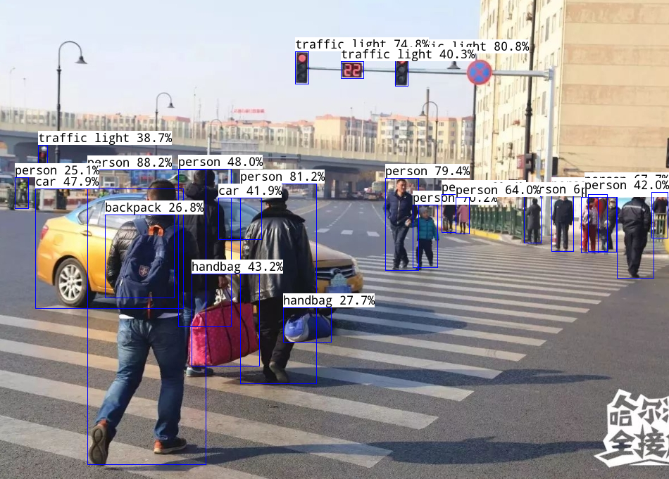

#### YOlOV5 SS928 3403 demo完整

### 一、编译

依赖ss928交叉编译工具，和Cmake

```
./build.sh
```


### 二、运行程序

复制整个output到板端，确保板端ko正常加载

```
cd output
./rudemo.sh test.jpg
```


### 三、效果图片如下




###  四、专栏相关

哔哩哔哩
<https://www.bilibili.com/video/BV1bH4y1u7nv/>

csdn
<https://blog.csdn.net/apchy_ll/category_12628981.html?spm=1001.2014.3001.5482>

###  五、其它
创造不易，谢谢大家支持


如果需要项目合作，请添加下面微信

